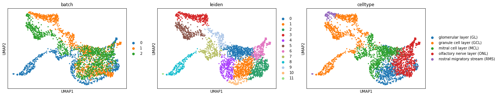
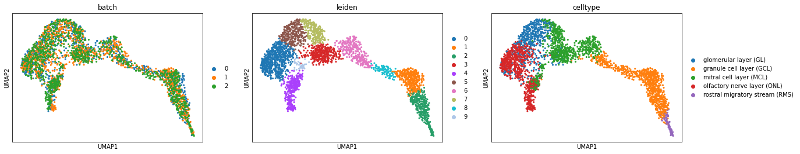

Import Packages and load datasets
~~~~~~~~~~~~~~~~~~~~~~~~~~~~~~~~~

.. code:: ipython3

    import os
    import sys

.. code:: ipython3

    sys.path.append(os.getcwd())

.. code:: ipython3

    import stereoAlign
    import scanpy as sc
    import numpy as np
    from anndata import AnnData

.. code:: ipython3

    dataset = AnnData.concatenate(*[sc.read_h5ad(os.path.join("demo_data", f)) for f in sorted(os.listdir("demo_data/"))])

Preprocessing datasets
~~~~~~~~~~~~~~~~~~~~~~

.. code:: ipython3

    stereoAlign.pp.summarize_counts(dataset)

.. code:: ipython3

    stereoAlign.pp.norma_log(dataset)

Optional:
~~~~~~~~~

Scaling counts to a mean of 0 and standard deviation of 1 using
``scanpy.pp.scale`` for each batch separately. It is possible to
effectively alleviate the impact of minor batch effects.

.. code:: ipython3

    dataset = stereoAlign.pp.scale_batch(dataset, batch="batch")

Visualization original dataset
~~~~~~~~~~~~~~~~~~~~~~~~~~~~~~

Before proceeding with the integration process, it is essential to
visualize the original dataset in its unadulterated form. This
visualization serves as a valuable reference point for understanding the
inherent characteristics and structure of the data.

.. code:: ipython3

    stereoAlign.pp.reduce_data(dataset, pca=True, pca_comps=100, neighbors=True, use_rep="X_pca", umap=True)

.. parsed-literal::

    PCA
    Nearest Neigbours
    UMAP

.. code:: ipython3

    sc.tl.leiden(dataset)

.. code:: ipython3

    sc.pl.umap(dataset, color=["batch", "leiden", "celltype"])

Calculation metric score using original datasets
~~~~~~~~~~~~~~~~~~~~~~~~~~~~~~~~~~~~~~~~~~~~~~~~

.. code:: ipython3

    stat_mean, pvalue_mean, accept_rate = stereoAlign.metrics.kbet(
        dataset, 
        key="batch", 
        use_rep="X_umap", 
        alpha=0.1,
        n_neighbors=15)

.. code:: ipython3

    stat_mean, pvalue_mean, accept_rate

.. parsed-literal::

    (17.30697483381354, 0.08259827579077056, 0.1910868868226996)

.. code:: ipython3

    stereoAlign.metrics.graph_connectivity(dataset, label_key="celltype")

.. parsed-literal::

    0.9896508327875588

.. code:: ipython3

    stereoAlign.metrics.silhouette(dataset, label_key="celltype", embed="X_umap")

.. parsed-literal::

    0.5907675176858902

Using ``Harmony`` to integration datasets
~~~~~~~~~~~~~~~~~~~~~~~~~~~~~~~~~~~~~~~~~

The corrected feature matrix will be saved in
``*.obsm["aligned_harmony"]``

.. code:: ipython3

    harmony_dataset = dataset.copy()
    harmony_corrected = stereoAlign.alg.harmony_alignment(harmony_dataset, batch_key="batch")

.. parsed-literal::

    	Initialization is completed.
    	Completed 1 / 10 iteration(s).
    	Completed 2 / 10 iteration(s).
    	Completed 3 / 10 iteration(s).
    	Completed 4 / 10 iteration(s).
    	Completed 5 / 10 iteration(s).
    	Completed 6 / 10 iteration(s).
    	Completed 7 / 10 iteration(s).
    	Completed 8 / 10 iteration(s).
    	Completed 9 / 10 iteration(s).
    	Completed 10 / 10 iteration(s).

.. code:: ipython3

    harmony_corrected

.. parsed-literal::

    AnnData object with n_obs × n_vars = 3119 × 20341
        obs: 'celltype', 'batch', 'n_counts', 'log_counts', 'n_genes', 'leiden'
        var: 'n_cells', 'mean-0', 'std-0', 'mean-1', 'std-1', 'mean-2', 'std-2'
        uns: 'pca', 'neighbors', 'umap', 'leiden', 'batch_colors', 'leiden_colors', 'celltype_colors'
        obsm: 'spatial', 'X_pca', 'X_umap', 'X_umap_knn_connectivity', 'X_umap_knn_distances', 'aligned_harmony'
        obsp: 'distances', 'connectivities'

Visualization of integrated datasets
~~~~~~~~~~~~~~~~~~~~~~~~~~~~~~~~~~~~

.. code:: ipython3

    stereoAlign.pp.reduce_data(
        harmony_corrected, pca=False, pca_comps=100, neighbors=True, use_rep="aligned_harmony", umap=True)

.. parsed-literal::

    Nearest Neigbours
    UMAP

.. code:: ipython3

    sc.tl.leiden(harmony_corrected)

.. code:: ipython3

    sc.pl.umap(harmony_dataset, color=["batch", "leiden", "celltype"])

Calculation metirc score using integrated datasets by ``Harmony``
~~~~~~~~~~~~~~~~~~~~~~~~~~~~~~~~~~~~~~~~~~~~~~~~~~~~~~~~~~~~~~~~~

| In order to quantify the performance and efficacy of the integrated
  datasets using the powerful ``Harmony``, we can calculate the metric
  score.
| This score serves as a reliable measure of the harmonious blending and
  seamless integration achieved through the amalgamation process.

-  Calculate the K-nearest neighbors Batch Effects Test (K-BET) metric
   of the data regarding a specific sample attribute and embedding. The
   K-BET metric measures if cells from different samples mix well in
   their local neighborhood.

-  Should the p-value surpass the predetermined alpha threshold, it is
   indicative that the data batch effect has indeed been successfully
   eradicated. This serves as a testament to the efficacy of the applied
   methodologies and techniques employed in the removal process.

.. code:: ipython3

    stat_mean, pvalue_mean, accept_rate = stereoAlign.metrics.kbet(
        harmony_corrected, 
        key="batch", 
        use_rep="aligned_harmony", 
        alpha=0.05,
        n_neighbors=15)

.. code:: ipython3

    stat_mean, pvalue_mean, accept_rate

.. parsed-literal::

    (11.041335043865018, 0.07790559676142805, 0.2792561718499519)

-  Calculate the Local inverse Simpson's Index (LISI) metric of the data
   regarding a specific sample attribute and embedding. The LISI metric
   measures if cells from different samples mix well in their local
   neighborhood.

-  The larger the ``ilisi_mean`` value, the better.

.. code:: ipython3

    ilisi_mean, lower, upper = stereoAlign.metrics.lisi(
        harmony_corrected, 
        key="batch", 
        use_rep="X_umap", 
        n_neighbors=15)

.. code:: ipython3

    ilisi_mean, lower, upper

.. parsed-literal::

    (2.501600357575848, 2.4877128083610844, 2.5154879067906113)

-  The smaller the ``clisi_mean`` value, the better.

.. code:: ipython3

    clisi_mean, lower, upper = stereoAlign.metrics.lisi(
        harmony_corrected, 
        key="celltype", 
        use_rep="X_umap", 
        n_neighbors=15)

.. code:: ipython3

    clisi_mean, lower, upper

.. parsed-literal::

    (1.2669337564931125, 1.2536753704133714, 1.2801921425728535)

-  Quantify the connectivity of the subgraph per cell type label.

.. code:: ipython3

    stereoAlign.metrics.graph_connectivity(harmony_corrected, label_key="celltype")

.. parsed-literal::

    0.985720075040572

-  Average silhouette width (ASW)

   The values range from [-1, 1] with

   ::

       * 1 indicates distinct, compact clusters
       * 0 indicates overlapping clusters
       * -1 indicates core-periphery (non-cluster) structure

   By default, the score is scaled between 0 and 1 (``scale=True``).

.. code:: ipython3

    stereoAlign.metrics.silhouette(harmony_corrected, label_key="celltype", embed="X_umap")

.. parsed-literal::

    0.6264222264289856

-  Modified average silhouette width (ASW) of batch

   This metric measures the silhouette of a given batch. It assumes that
   a silhouette width close to 0 represents perfect overlap of the
   batches, thus the absolute value of the silhouette width is used to
   measure how well batches are mixed.

.. code:: ipython3

    stereoAlign.metrics.silhouette_batch(
        harmony_corrected, batch_key="batch", label_key="celltype", embed="X_umap")

.. parsed-literal::

    mean silhouette per group:                                 silhouette_score
    group                                           
    glomerular layer (GL)                   0.726641
    granule cell layer (GCL)                0.937189
    mitral cell layer (MCL)                 0.885625
    olfactory nerve layer (ONL)             0.907767
    rostral migratory stream (RMS)          0.616016

.. parsed-literal::

    0.8146478069247627

